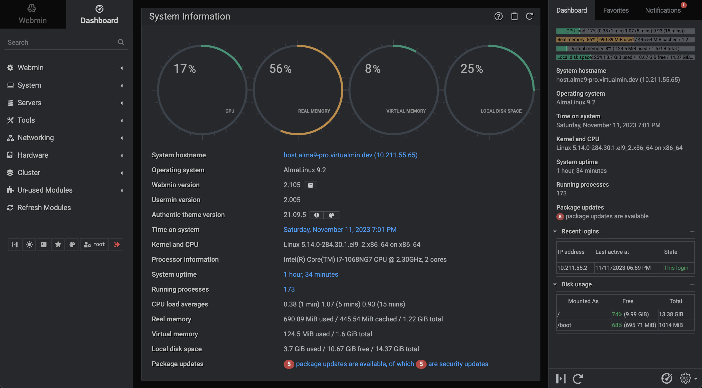

# docker-webmin: *Dockerfile for webmin*


## Building the image
```
git clone https://github.com/sfcampbell/docker-webmin
cd docker-webmin
docker build -t sfcampbell/webmin .
```

## Running the container
```
docker run -d -p 10000:10000 sfcampbell/webmin
```

Log into webmin and manage your server
```
http://hostname.or.ip:10000
(root:pass)
```
**(Don't forget to change the password asap!)**

## Props
Forked from [chsliu/webmin](https://github.com/chsliu/docker-webmin.git) -- props to them for the project!  Unfortunately it had gotten a little stale so the base image and installation method wouldn't work any more... This repo builds on `debian:stable-slim` and the new scripted installation from [Webmin](https://webmin.com/).